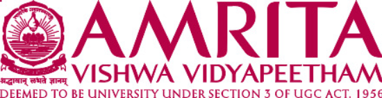

# Autonomous Self-Stabilizing Drone with Obstacle Avoidance

<p align="center">
  
</p>

<p align="center">
  <strong>Amrita Vishwa Vidyapeetham</strong><br>
  Coimbatore, Tamil Nadu, India
</p>

<p align="center">
  <strong>Department of Artificial Intelligence</strong>
</p>

---

## 1. Project Overview

This project focuses on developing an autonomous self-stabilizing drone simulation using MuJoCo.

The simulated drone is designed to follow a planned trajectory, detect obstacles, avoid collisions, maintain stable flight, and recover from unsafe attitude conditions.

The project combines control systems, trajectory planning, obstacle avoidance, state estimation, and machine learning-based safety prediction.

The simulation is being developed incrementally, beginning with a single-obstacle scenario and extending toward multiple obstacles, multiple targets, and wind-disturbance scenarios.

## 2. Project Objectives

- Develop a drone simulation using MuJoCo.
- Implement PID-based attitude stabilization.
- Generate smooth trajectories using cubic B-splines.
- Detect obstacles and plan collision-free paths.
- Maintain stable roll and pitch angles during flight.
- Investigate system observability and controllability.
- Develop a machine learning-based safety prediction component.
- Implement recovery control for unsafe attitude conditions.
- Evaluate drone behavior under external disturbances such as wind.

## 3. System Workflow

```text
Drone Initialization
        |
        v
Stable Hover
        |
        v
Trajectory Generation
        |
        v
Forward Movement
        |
        v
Obstacle Detection
        |
        v
Obstacle Avoidance
        |
        v
Continue Along Planned Trajectory
        |
        v
Attitude Safety Monitoring
        |
        v
Machine Learning Safety Prediction
        |
        v
Unsafe Condition Detected
        |
        v
Recovery Controller
        |
        v
Roll and Pitch Stabilization
        |
        v
Resume Trajectory
        |
        v
Target Reached
```

The workflow describes the intended system behavior. Individual stages are implemented and validated through separate simulation experiments.

## 4. Technologies Used

| Component | Technology |
|---|---|
| Programming language | Python |
| Physics simulation | MuJoCo |
| Numerical computation | NumPy |
| Trajectory planning | B-spline curves |
| Flight stabilization | PID control |
| Machine learning | Logistic Regression |
| Visualization | MuJoCo viewer and plotting tools |
| Development environment | Python / Conda |

## 5. Repository Structure

```text
Drone_MuJoCo_Project/
│
├── analysis/
│
├── control/
│   ├── position_controller.py
│   └── ...
│
├── experiments/
│
├── navigation/
│   ├── bspline.py
│   ├── b_spline_trajectory.py
│   ├── obstacle_planner.py
│   ├── planned_bspline.py
│   ├── plot_planned_bspline.py
│   └── waypoint_planner.py
│
├── prediction/
│
├── results/
│
├── sensors/
│
├── simulation/
│   ├── drone_model.xml
│   ├── mixer.py
│   ├── mujoco_force_assignment_test.py
│   ├── pid_mixer_mujoco_test.py
│   ├── pid_mixer_mujoco_viewer.py
│   ├── pid_roll_test.py
│   └── position_bspline_mujoco_test.py
│
├── assets/
│   └── amrita_logo.png
│
├── README.md
└── .gitignore
```

This structure represents the project organization; individual files may change as development continues.

## 6. Mathematical Model

### 6.1 Drone Attitude Dynamics

For a simplified rotational model, the angular motion is described by:

\[
I\ddot{\theta}(t)=\tau(t)
\]

where:

- \(I\) is the moment of inertia.
- \(\theta(t)\) is the angular position.
- \(\tau(t)\) is the applied torque.

Taking the Laplace transform with zero initial conditions:

\[
Is^2\Theta(s)=\Tau(s)
\]

The transfer function is:

\[
\boxed{
G(s)=\frac{\Theta(s)}{\Tau(s)}
=\frac{1}{Is^2}
}
\]

This is a simplified single-axis rotational model. A complete drone model must account for coupled rotational and translational dynamics.

### 6.2 PID Controller

The PID controller generates a control signal using the proportional, integral, and derivative components of the error.

The control error is:

\[
e(t)=\theta_{\mathrm{desired}}(t)-\theta_{\mathrm{actual}}(t)
\]

The PID control law is:

\[
\boxed{
u(t)=K_p e(t)
+K_i\int_0^t e(\lambda)\,d\lambda
+K_d\frac{de(t)}{dt}
}
\]

where:

- \(K_p\) is the proportional gain.
- \(K_i\) is the integral gain.
- \(K_d\) is the derivative gain.

The proportional term responds to the current error.

The integral term accumulates past error.

The derivative term responds to the rate of change of error.

### 6.3 PID Gain Calculation

For the simplified plant:

\[
I\ddot{\theta}=\tau
\]

the characteristic polynomial of the closed-loop system can be designed using:

\[
(s^2+2\zeta\omega_n s+\omega_n^2)(s+p_3)
\]

Expanding:

\[
s^3+(2\zeta\omega_n+p_3)s^2
+(\omega_n^2+2\zeta\omega_n p_3)s
+\omega_n^2p_3
\]

Matching the coefficients gives:

\[
\boxed{
K_d=I(2\zeta\omega_n+p_3)
}
\]

\[
\boxed{
K_p=I(\omega_n^2+2\zeta\omega_n p_3)
}
\]

\[
\boxed{
K_i=I\omega_n^2p_3
}
\]

where:

- \(\zeta\) is the damping ratio.
- \(\omega_n\) is the natural frequency.
- \(p_3\) is the additional real pole.
- \(I\) is the moment of inertia.

These expressions are derived for the simplified rotational plant and the stated characteristic polynomial. The resulting gains must be checked against the actual simulation dynamics and actuator limits.

### 6.4 B-Spline Trajectory Planning

A B-spline is a piecewise polynomial curve defined by control points and a knot vector.

The general B-spline curve is:

\[
\boxed{
P(u)=\sum_{i=0}^{n}N_{i,p}(u)P_i
}
\]

where:

- \(P(u)\) is the position on the curve.
- \(P_i\) are control points.
- \(N_{i,p}(u)\) are B-spline basis functions.
- \(p\) is the degree of the spline.
- \(u\) is the curve parameter.

#### Degree-zero basis function

The degree-zero basis function is:

\[
N_{i,0}(u)=
\begin{cases}
1, & t_i\leq u<t_{i+1},\\
0, & \text{otherwise}.
\end{cases}
\]

where \(t_i\) are knot values.

#### Cox-de Boor recursion formula

For degree \(p>0\):

\[
\begin{aligned}
N_{i,p}(u)
={}&
\frac{u-t_i}{t_{i+p}-t_i}N_{i,p-1}(u)\\
&+
\frac{t_{i+p+1}-u}{t_{i+p+1}-t_{i+1}}
N_{i+1,p-1}(u)
\end{aligned}
\]

A term with a zero denominator is defined as zero.

A cubic B-spline uses:

\[
p=3
\]

Cubic B-splines can provide smooth trajectory geometry when the control points and knot vector are appropriately selected.

### 6.5 Direct Path and Waypoints

A straight-line path between start and goal positions can be represented as:

\[
P(\lambda)=P_s+\lambda(P_g-P_s)
\]

where:

- \(P_s\) is the start position.
- \(P_g\) is the goal position.
- \(\lambda\in[0,1]\).

For \(N\) intervals, sample the path using:

\[
\lambda_k=\frac{k}{N},
\qquad k=0,1,\ldots,N
\]

A collision-free waypoint planner can first generate a safe sequence of waypoints. A B-spline can then be constructed from an appropriate set of points to obtain a smooth trajectory.

The final trajectory must be checked for collision clearance because smoothing a path can cause it to pass closer to obstacles than the original waypoint path.

### 6.6 Obstacle Representation

An axis-aligned box obstacle can be represented by its center and dimensions.

For a box with center \(c\) and size \(d\):

\[
b_{\min}=c-\frac{d}{2}
\]

\[
b_{\max}=c+\frac{d}{2}
\]

A safety margin \(d_s\) can be included by inflating the obstacle bounds:

\[
b_{\min}^{\mathrm{inflated}}
=b_{\min}-d_s
\]

\[
b_{\max}^{\mathrm{inflated}}
=b_{\max}+d_s
\]

The planner can use the inflated obstacle to account for a desired clearance around the drone.

## 7. Observability and Controllability

### 7.1 State-Space Representation

A linear system can be represented as:

\[
\dot{x}=Ax+Bu
\]

\[
y=Cx+Du
\]

where:

- \(x\) is the state vector.
- \(u\) is the control input.
- \(y\) is the measured output.
- \(A\) is the state matrix.
- \(B\) is the input matrix.
- \(C\) is the output matrix.
- \(D\) is the direct transmission matrix.

### 7.2 Observability

Observability describes whether the internal states of a system can be reconstructed from its outputs over time.

The observability matrix is:

\[
\mathcal{O}=
\begin{bmatrix}
C\\
CA\\
CA^2\\
\vdots\\
CA^{n-1}
\end{bmatrix}
\]

The system is observable if:

\[
\boxed{
\mathrm{rank}(\mathcal{O})=n
}
\]

where \(n\) is the number of states.

### 7.3 Controllability

Controllability describes whether the system can be driven from an initial state to a desired state using suitable control inputs.

The controllability matrix is:

\[
\mathcal{C}=
\begin{bmatrix}
B & AB & A^2B & \cdots & A^{n-1}B
\end{bmatrix}
\]

The system is controllable if:

\[
\boxed{
\mathrm{rank}(\mathcal{C})=n
}
\]

The observability and controllability conditions must be evaluated using the actual state-space matrices selected for the drone model.

## 8. Obstacle Avoidance

The obstacle avoidance subsystem is designed to detect obstacles and adjust the planned route to maintain a safe distance.

The intended process is:

1. Obtain obstacle information from the simulated sensors.
2. Represent obstacles geometrically.
3. Inflate obstacles using a selected safety margin.
4. Generate candidate waypoints.
5. Check candidate paths for collisions.
6. Select a collision-free route.
7. Generate a smooth trajectory.
8. Track the trajectory using the control system.

The planner should be tested with multiple obstacle configurations before extending it to more complex environments.

## 9. Machine Learning-Based Safety Prediction

The project includes a planned Logistic Regression classifier for safety prediction.

The classifier can use selected drone state features, such as:

- Roll angle.
- Pitch angle.
- Angular velocity.
- Position or trajectory tracking error.

The model predicts a safety class based on its trained parameters.

For a binary classifier:

\[
P(y=1\mid x)=
\frac{1}{1+e^{-z}}
\]

where:

\[
z=w^Tx+b
\]

and:

- \(x\) is the feature vector.
- \(w\) is the learned weight vector.
- \(b\) is the bias.
- \(y=1\) represents the designated positive class.

The predicted class depends on the selected classification threshold.

The training dataset, feature definitions, threshold, and evaluation metrics must be documented when the classifier is implemented and validated.

## 10. Recovery Controller

The recovery controller is intended to respond when the drone's attitude is classified as unsafe.

The recovery sequence is:

1. Detect an unsafe attitude condition.
2. Reduce or suspend trajectory tracking commands as appropriate.
3. Generate corrective control commands.
4. Stabilize roll and pitch toward the desired attitude.
5. Confirm that the drone has returned to an acceptable state.
6. Resume trajectory tracking.

A safety classifier alone does not guarantee recovery. Recovery behavior must be validated using the drone dynamics, controller limits, and simulated disturbance scenarios.

## 11. Wind Disturbance Scenario

The wind scenario is intended to evaluate the drone's ability to stabilize before resuming trajectory movement.

The desired workflow is:

```text
Wind Disturbance
       |
       v
Detect Attitude / Position Deviation
       |
       v
Stabilization Controller
       |
       v
Recover Desired Attitude
       |
       v
Check Stability Conditions
       |
       v
Resume B-Spline Trajectory
```

The simulation should record the drone's attitude, position error, and recovery behavior during the disturbance.

## 12. Installation and Setup

### Prerequisites

- Python
- Conda
- MuJoCo
- Required Python packages

Activate the project's Conda environment:

```powershell
conda activate drone_mujoco
```

Navigate to the project directory:

```powershell
cd C:\Users\patim\Documents\Drone_MuJoCo_Project
```

Install dependencies using the project's dependency file if one is available.

For example, if the project contains a `requirements.txt` file:

```powershell
python -m pip install -r requirements.txt
```

The exact dependencies should match the current implementation.

## 13. Running the Simulation

Run scripts from the project root directory unless the individual script specifies otherwise.

Example:

```powershell
python simulation\pid_roll_test.py
```

For a Python module inside the navigation package, use module execution from the project root:

```powershell
python -m navigation.waypoint_planner
```

Use the actual script corresponding to the scenario being tested.

## 14. Experiments

The project is intended to be developed through separate experiments.

| Experiment | Objective |
|---|---|
| Attitude stabilization | Test PID-based roll and pitch control |
| Force assignment | Verify rotor force application |
| Position control | Test position tracking |
| B-spline trajectory | Generate and track smooth trajectories |
| Single obstacle | Validate basic obstacle avoidance |
| Multiple obstacles | Evaluate route planning in more complex environments |
| Multiple targets | Evaluate sequential target navigation |
| Wind disturbance | Evaluate stabilization and trajectory resumption |
| Safety prediction | Evaluate unsafe-state classification |
| Recovery control | Evaluate recovery from attitude deviations |

The results section should be updated only after the corresponding experiment has been executed and its outputs recorded.

## 15. Results

Simulation results, plots, and experiment logs will be added here as they are produced and verified.

No performance values are reported in this section until they have been obtained from actual simulation runs.

## 16. Team Details

**Institution:** Amrita Vishwa Vidyapeetham

**Campus:** Coimbatore

**Team:** AB14

| Name | Student ID | Email |
|---|---|---|
| Devisri | CB.SC.U4AIE24163 | devisri7142@gmail.com |
| Monisha | CB.SC.U4AIE24157 | vemurimonishareddy@gmail.com |
| Myagi | CB.SC.U4AIE24143 | patimamyagi@gmail.com |

## 17. Future Work

- Complete and validate the baseline simulation.
- Extend obstacle avoidance to multiple obstacles.
- Extend navigation to multiple targets.
- Implement and evaluate wind stabilization.
- Integrate and evaluate safety prediction.
- Validate recovery controller behavior.
- Record reproducible simulation results.
- Prepare mathematical derivations and experiment explanations for project evaluation.

---

<p align="center">
  <strong>Autonomous Self-Stabilizing Drone with Obstacle Avoidance</strong><br>
  Amrita Vishwa Vidyapeetham — Coimbatore
</p>